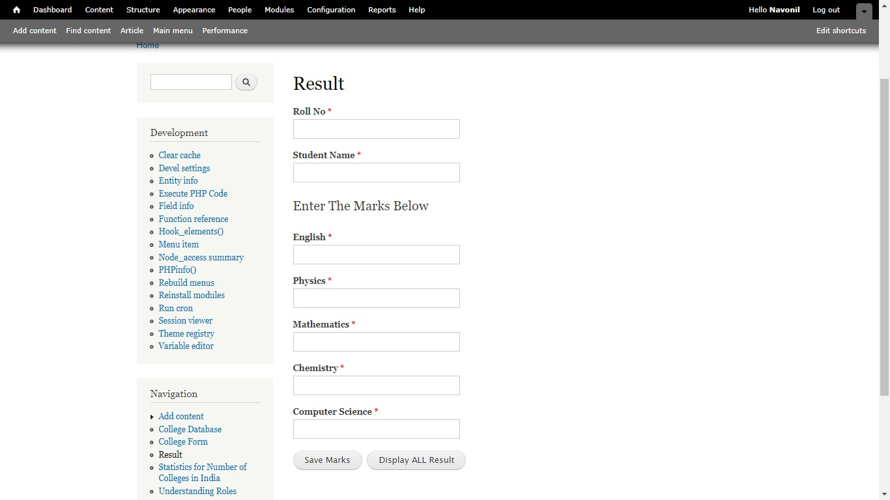
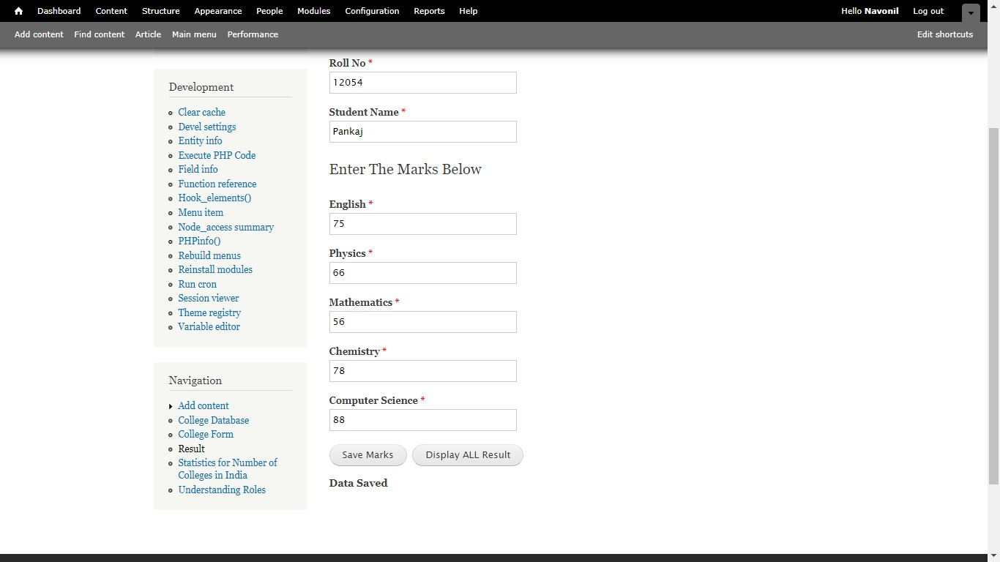
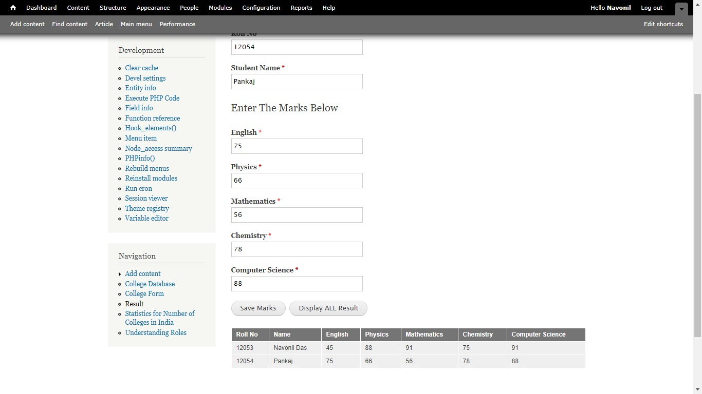

# roles_marks module
It is a Drupal Module , Which display / edit marks depending upon the role of the user.

## Adding Roles
This link tell [How to Add User Role](https://www.drupal.org/docs/7/managing-users/user-roles).
Add two roles 'Student' , 'Teacher' maintain the caplital letter at starting.

## Ask User for the role during signup
To do this we need a extra module known as [Auto Assign Role](https://www.drupal.org/project/autoassignrole).
Dowload and [install](https://www.inmotionhosting.com/support/edu/drupal-7/intro-to-modules/how-to-upload-a-new-module-to-drupal) the module.
After installation go to your admin account then click on Configuration then on the People Section click on Auto Assign Role then click on User Choice set it to enabled.
Set The following Settings:
- Check the Student and Teacher on Roles Section.
- Set single role on User role Selection
Set everthing else to default and click on Save configuration.

## Demo
### Student View

### Teacher/Admin View

Saving Data to the Database : 

Displaying Complete Database
